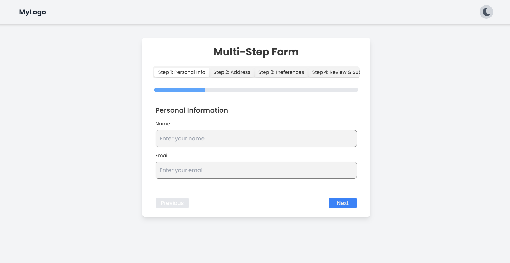
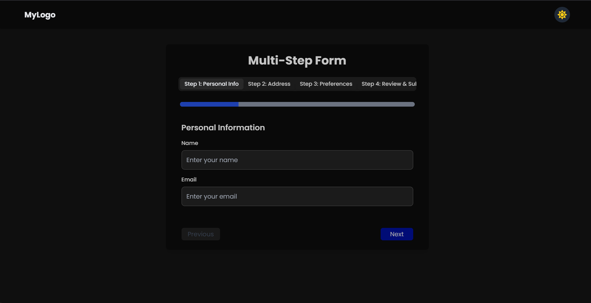

# Multi-Step Form with Dark Mode and UI Enhancements

This is a Next.js project that features a sleek multi-step form layout with a dark mode toggle and enhanced UI powered by Tailwind CSS, ShadCN UI, and Framer Motion. It also includes mock API integration for form state updates.

---

## 🌟 Features

- Multi-step form with navigation and progress tracking
- Dark mode toggle with seamless transitions
- Global state management using Context API
- Animations and smooth transitions with Framer Motion
- Mock API integration for form state updates
- Fully responsive and accessible design

---

## 🖼️ Screenshots

| Light Mode                              | Dark Mode                              |
|----------------------------------------|----------------------------------------|
|  |  |

---

## 🛠️ Technology Stack

- **Framework**: [Next.js](https://nextjs.org/)
- **Styling**: [Tailwind CSS](https://tailwindcss.com/)
- **UI Components**: [ShadCN UI](https://shadcn.dev/)
- **Animations**: [Framer Motion](https://www.framer.com/motion/)
- **Mock API**: JSON Mock API & Next.js API Routes

---

## 🔧 Prerequisites

- **Node.js**: Version 16 or later  
- **npm**: Version 7 or later (or use Yarn)  

---

## 🚀 Getting Started

### Step 1: Clone the Repository

```bash
git clone https://github.com/your-repo/multi-step-form.git
cd multi-step-form
```
### Step 2: Install Dependencies
 ```bash
npm install
```
**Configure Tailwind CSS for Dark Mode**:
  - In your `tailwind.config.js`, configure the `darkMode` strategy to `"class"`:
   ```js
   module.exports = {
    content: [
      "./pages/**/*.{js,ts,jsx,tsx}",
      "./components/**/*.{js,ts,jsx,tsx}",
       ],
      theme: {
      extend: {},
       },
      plugins: [],
      darkMode: 'class', // Enable dark mode via class strategy
     };
```
## Step 3: 🏃‍♂️ Running the Development Server

Once you have set up the project, run the development server:

```bash
npm run dev
# or
yarn dev
# or
pnpm dev
```

## 📁 Project Structure

- `pages/`: Contains the pages for each step of the form.
- `components/`: Contains reusable components such as the form layout, form steps, and navigation components.
- `styles/`: Contains Tailwind CSS files and global styles.
- `public/`: Stores static assets like images or icons.

## 🤝 Contributing

We welcome contributions! Follow these steps:

1. **Fork the repository.**
 
2. **Clone your forked repository:**
   ```bash
   git clone https://github.com/your-username/multi-step-form.git
   cd multi-step-form
   ```
3. **Create a feature branch.**:
   ```bash
   git checkout -b feature-name
   ```
4. Commit your changes:
   ```bash
    git commit -m "Add feature description"
    ```
5. **Push to the branch.**:
   ```bash
    git push origin feature-name
    ```
6. **Open a pull request in the original repository.**


## 📜 License
This project is licensed under the MIT License.

## 📨 Contact
For queries, feel free to reach out:
Sreenand S -sreenands93@gmail.com


